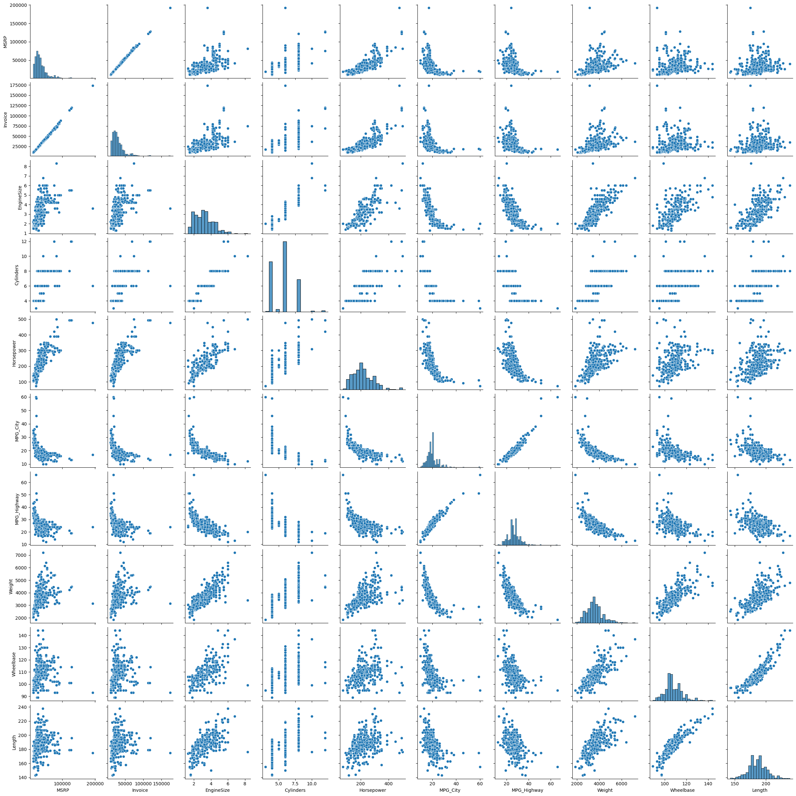
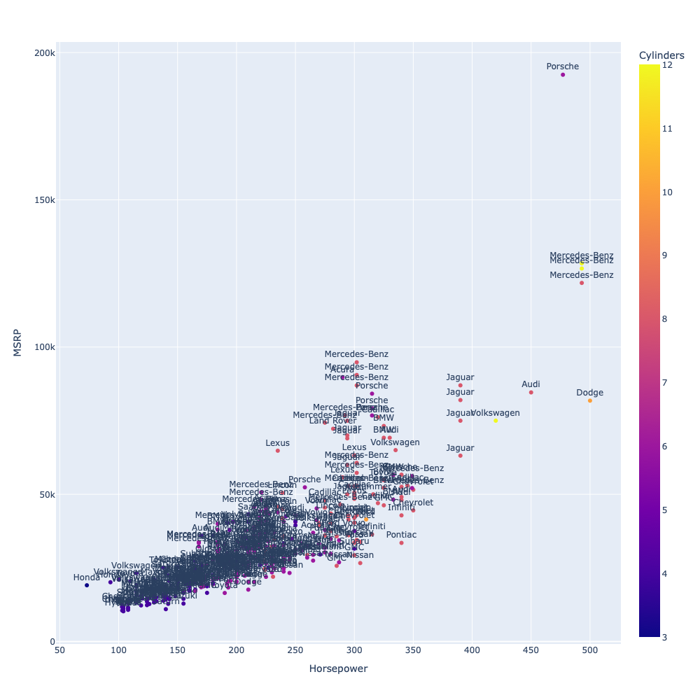
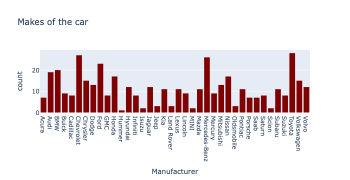
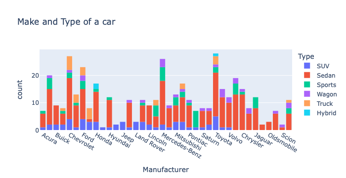
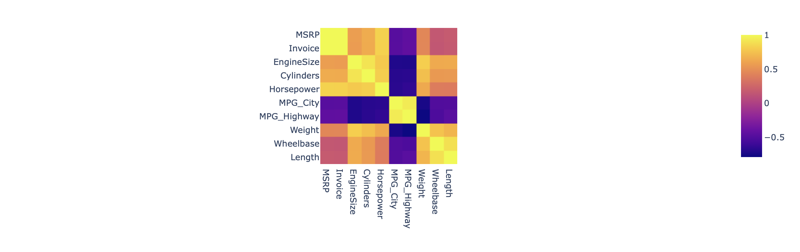
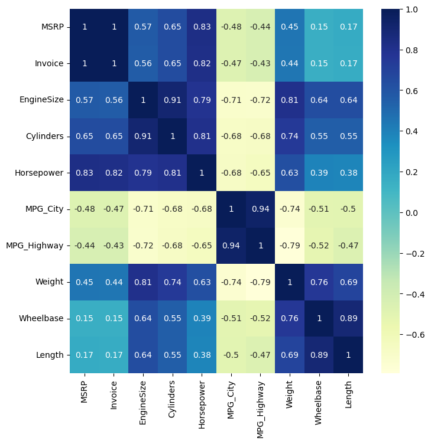

# 📓 Short Data Visualization Training

## 🗂️ Data Description

The dataset contains information about various cars models, including features such as:
  - Make,
  - Model,
  - Type,
  - Origin,
  - Drive Train,
  - MSRP,
  - Invoice,
  - Engine Size,
  - Horsepower,
  - Number of cylinders,
  - MPG (City and Highway),
  - Weight,
  - Wheelbase,
  - Length.  

It includes both numerical and categorical variables, with some missing values handled during preprocessing.  

This data is used for exploring relationships between vehicle specifications and pricing.

## Technologies and Libraries Used:
- **Python**
- **Jupyter Notebook**
  
- Matplotlib  
- Seaborn  
- Plotly Express
- Numpy  

## Contents

- 🧹 Data cleaning basics
- 📊 Scatter plots & pair plots
- 🔥 Correlation heatmaps
- ☁️ Wordcloud (text visualization)
- ⚡️ Small tricks for working efficiently in Jupyter  

---

### 📸 Here's a few screenshots of resulted plots  

>>   
*Scatter Pair Plot (Seaborn)*

>>   
*Scatterplot (Plotly Express)*  

---

>>   
*Sample histogram 1*  

>>   
*Sample histogram 2*  

---

>>   
*Correlation Matrix (Plotly Express)*
>>   
*Correlation Matrix (Seaborn)*

---
